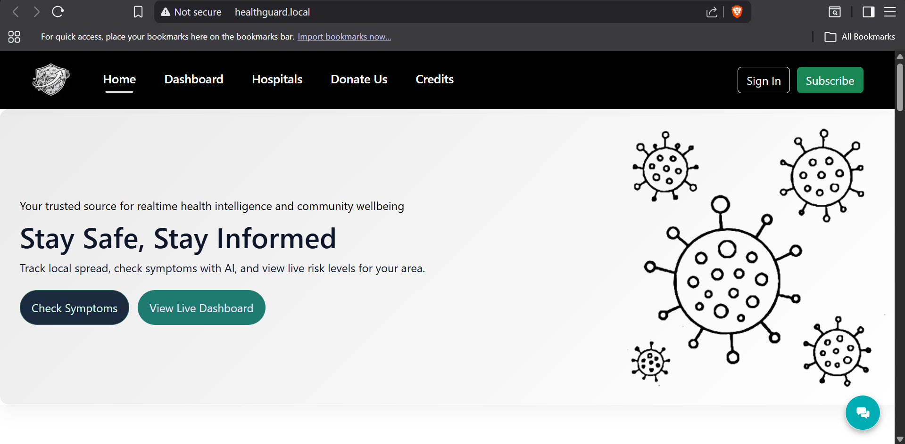
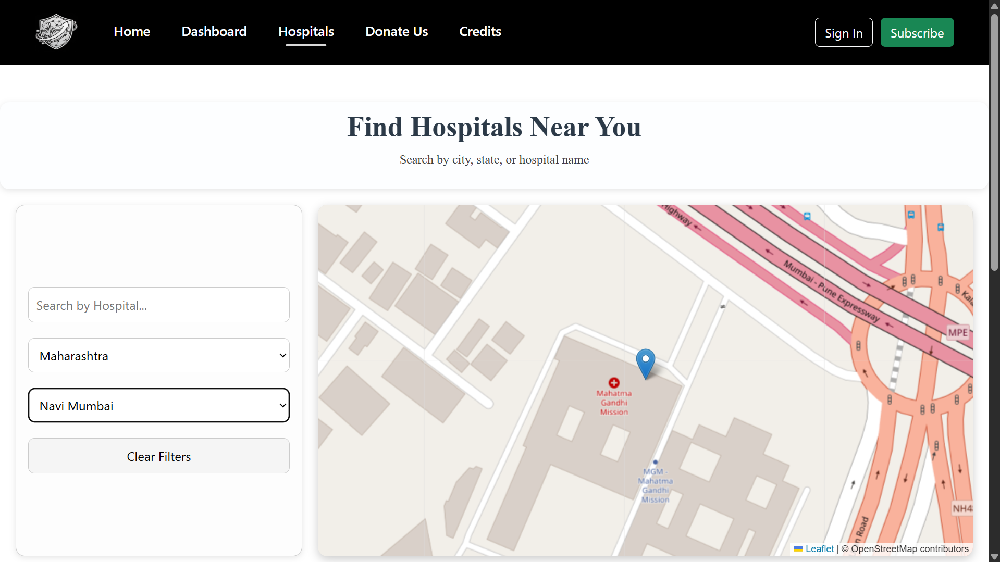
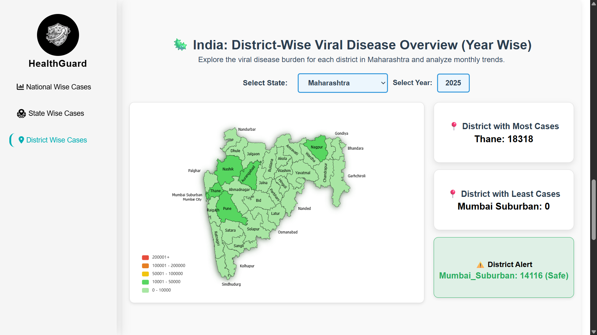
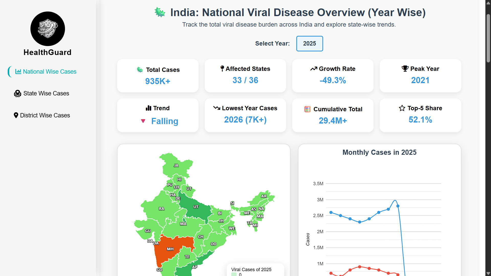
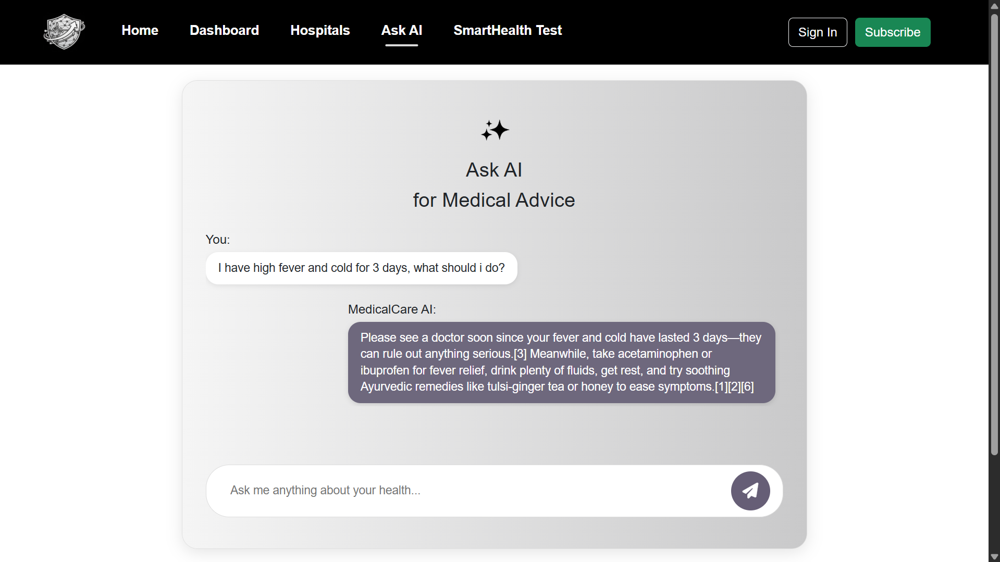
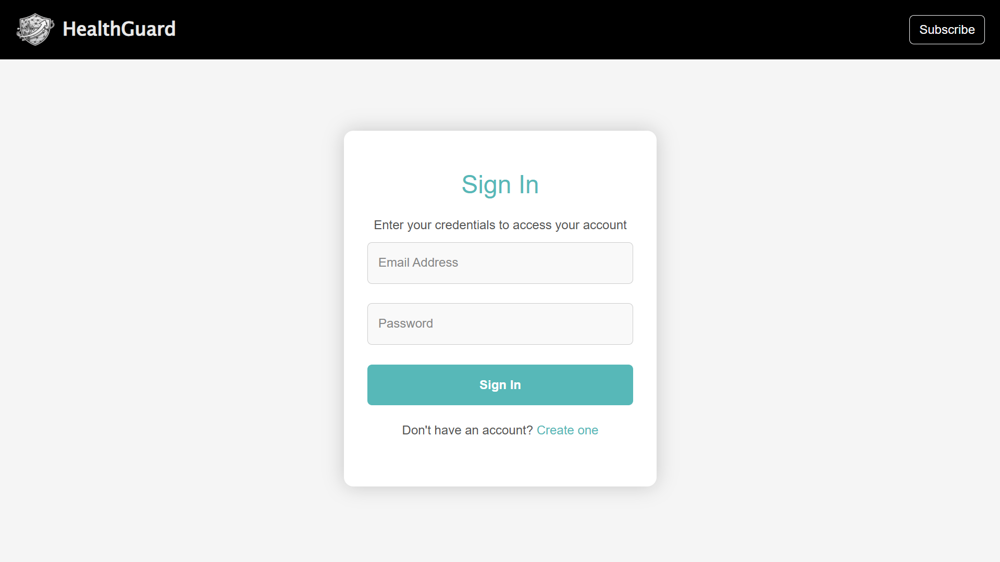
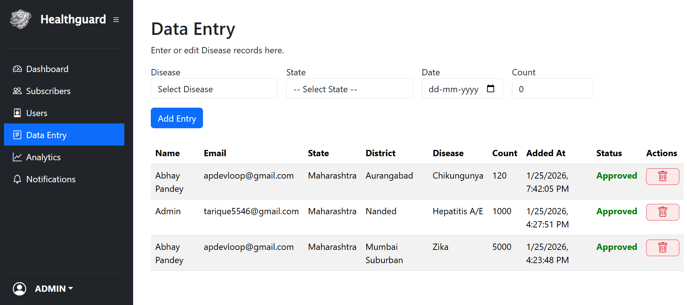
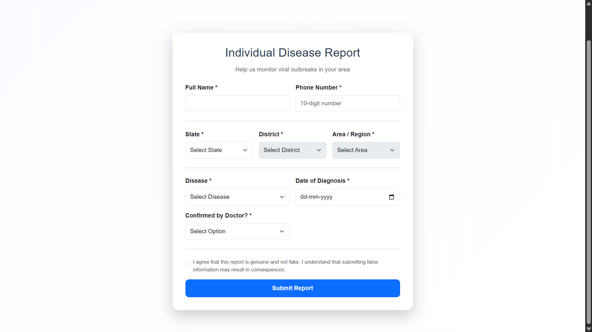

# Health-Guard

Health-Guard is a modular, AI-assisted, district-level viral disease reporting and alert escalation platform.
It integrates verified community reporting, threshold-based outbreak monitoring, and controlled alert dissemination through SMS and email.

This system is designed for structured disease surveillance experiments and decentralized public health alert workflows.

## Why Use Health-Guard?

### Health-Guard enables:

Verified disease data submission (admin approval workflow)

District and area-level aggregation

Threshold-based alert escalation

24-hour rolling window micro-area alerts

Daily scheduled summary notifications (1 PM cron-based system)

AI-powered symptom interaction (Perplexity API)

Firebase-authenticated user login

SMS alerts (Twilio)

Email alerts (Gmail App Password)

Multi-layer data aggregation (area → district → state)

Unlike generic dashboards, Health-Guard separates:

User-level reporting

Administrator verification

Threshold escalation logic

Scheduled notification windows

This architecture ensures reproducibility and research-grade modularity.

Technology Stack

### Backend:

Node.js

Express.js

MySQL

Firebase Admin SDK

JWT Authentication

bcrypt

node-cron

External Services:

Firebase Authentication

Twilio (SMS)

Gmail (App Password SMTP)

Perplexity API (AI Assistant)

### Frontend:

HTML

CSS

JavaScript

### Installation Guide
1. Install Node.js

Download and install Node.js (v18 or higher):

https://nodejs.org

### Verify installation:

node -v
npm -v
2. Clone Repository
git clone https://github.com/YOUR_USERNAME/health-guard.git
cd health-guard
3. Install Dependencies
npm install

#### This installs:

express

mysql2

dotenv

cors

axios

bcrypt

jsonwebtoken

nodemailer

firebase-admin

twilio

node-cron

body-parser

4. Environment Configuration

#### Create a file:

.env

#### Add:

DB_HOST=localhost
DB_USER=root
DB_PASS=your_db_password
DB_NAME=healthguard_db

JWT_SECRET=your_random_secret_key

ADMIN_EMAIL=your_admin_email

EMAIL_USER=your_gmail_address
EMAIL_PASS=your_gmail_app_password

TWILIO_ACCOUNT_SID=your_twilio_sid
TWILIO_AUTH_TOKEN=your_twilio_token
TWILIO_PHONE_NUMBER=your_twilio_number

PERPLEXITY_API_KEY=your_perplexity_api_key

BASE_URL=http://localhost:3000

Do NOT upload .env to GitHub.

5. Firebase Setup

Go to https://console.firebase.google.com

Create new project

Enable Authentication → Email/Password

Generate Service Account Key

#### Save as:

firebase-admin-key.json

This file must remain local and must NOT be uploaded.

Update login.html and register.html

#### Replace:

What is this?

with your real Firebase project configuration.

6. Gmail App Password Setup

Enable 2-step verification in Gmail

Generate App Password

#### Use it as:

EMAIL_PASS=generated_app_password
7. Twilio Setup

Create account at https://twilio.com

#### Get:

Account SID

Auth Token

Twilio phone number

Add them to .env

8. Perplexity API Setup

Create account at https://perplexity.ai

Generate API key

#### Add:

PERPLEXITY_API_KEY=your_key
9. MySQL Database Setup

#### Open MySQL and run:

CREATE DATABASE healthguard_db;
USE healthguard_db;
Database Schema

Below are all required tables.

users
CREATE TABLE users (
    id INT AUTO_INCREMENT PRIMARY KEY,
    full_name VARCHAR(100),
    email VARCHAR(100) UNIQUE,
    contact_number VARCHAR(15),
    gender ENUM('Male','Female','Other'),
    dob DATE,
    state VARCHAR(50),
    password VARCHAR(255),
    created_at TIMESTAMP DEFAULT CURRENT_TIMESTAMP,
    firebase_uid VARCHAR(128) UNIQUE
);
subscribers
CREATE TABLE subscribers (
    id INT AUTO_INCREMENT PRIMARY KEY,
    full_name VARCHAR(100),
    email VARCHAR(100),
    phone_number VARCHAR(15),
    state VARCHAR(50),
    district VARCHAR(50),
    area VARCHAR(150),
    disease VARCHAR(50),
    approved TINYINT DEFAULT 0,
    created_at TIMESTAMP DEFAULT CURRENT_TIMESTAMP
);
disease_counts
CREATE TABLE disease_counts (
    id INT AUTO_INCREMENT PRIMARY KEY,
    user_id INT,
    user_full_name VARCHAR(255),
    user_email VARCHAR(255),
    state VARCHAR(50),
    district VARCHAR(50),
    disease VARCHAR(50),
    count INT,
    added_at TIMESTAMP DEFAULT CURRENT_TIMESTAMP,
    is_approved TINYINT DEFAULT 0,
    year INT,
    FOREIGN KEY (user_id) REFERENCES users(id)
);
individual_reports
CREATE TABLE individual_reports (
    id INT AUTO_INCREMENT PRIMARY KEY,
    phone_number VARCHAR(15),
    state VARCHAR(100),
    district VARCHAR(100),
    area VARCHAR(150),
    disease VARCHAR(100),
    created_at TIMESTAMP DEFAULT CURRENT_TIMESTAMP,
    full_name VARCHAR(100),
    diagnosis_date DATE,
    doctor_confirmed ENUM('Yes','No')
);
notifications
CREATE TABLE notifications (
    id INT AUTO_INCREMENT PRIMARY KEY,
    subscriber_id INT,
    user_id INT,
    message TEXT,
    sent_via VARCHAR(20),
    created_at TIMESTAMP DEFAULT CURRENT_TIMESTAMP,
    recipient_type ENUM('subscriber','user'),
    FOREIGN KEY (subscriber_id) REFERENCES subscribers(id),
    FOREIGN KEY (user_id) REFERENCES users(id)
);
areas
CREATE TABLE areas (
    id INT AUTO_INCREMENT PRIMARY KEY,
    state VARCHAR(100),
    district VARCHAR(100),
    area_name VARCHAR(150)
);
state_cases
CREATE TABLE state_cases (
    id INT AUTO_INCREMENT PRIMARY KEY,
    year INT,
    state_ut VARCHAR(50),
    cases INT DEFAULT 0
);
state_disease_data
CREATE TABLE state_disease_data (
    id INT AUTO_INCREMENT PRIMARY KEY,
    state_name VARCHAR(100),
    report_date DATE,
    covid_19 INT DEFAULT 0,
    dengue INT DEFAULT 0,
    chikungunya INT DEFAULT 0,
    zika INT DEFAULT 0,
    hfmd INT DEFAULT 0,
    hepatitis_a_e INT DEFAULT 0,
    other INT DEFAULT 0,
    created_at TIMESTAMP DEFAULT CURRENT_TIMESTAMP
);
district_viral_cases
CREATE TABLE district_viral_cases (
    id INT AUTO_INCREMENT PRIMARY KEY,
    district VARCHAR(50),
    year INT,
    covid19 INT DEFAULT 0,
    dengue INT DEFAULT 0,
    chikungunya INT DEFAULT 0,
    zika INT DEFAULT 0,
    hfmd INT DEFAULT 0,
    hepatitis_ae INT DEFAULT 0,
    other_minor_viral INT DEFAULT 0
);
district_year_cases
CREATE TABLE district_year_cases (
    id INT AUTO_INCREMENT PRIMARY KEY,
    year INT,
    state VARCHAR(100),
    district VARCHAR(100),
    cases INT DEFAULT 0
);
area_alert_windows
CREATE TABLE area_alert_windows (
    id INT AUTO_INCREMENT PRIMARY KEY,
    state VARCHAR(100),
    district VARCHAR(100),
    area VARCHAR(100),
    disease VARCHAR(100),
    last_summary_sent_at DATETIME,
    threshold_sent_at DATETIME
);
area_alert_cycles
CREATE TABLE area_alert_cycles (
    id INT AUTO_INCREMENT PRIMARY KEY,
    state VARCHAR(100),
    district VARCHAR(100),
    area VARCHAR(150),
    disease VARCHAR(100),
    last_summary_sent_at DATETIME
);
area_daily_counts
CREATE TABLE area_daily_counts (
    id INT AUTO_INCREMENT PRIMARY KEY,
    state VARCHAR(100),
    district VARCHAR(100),
    area VARCHAR(150),
    disease VARCHAR(100),
    report_date DATE,
    total_count INT,
    threshold_alert_sent TINYINT DEFAULT 0,
    scheduled_alert_sent TINYINT DEFAULT 0
);
area_daily_archive
CREATE TABLE area_daily_archive (
    id INT AUTO_INCREMENT PRIMARY KEY,
    area_name VARCHAR(100),
    state VARCHAR(100),
    district VARCHAR(100),
    disease VARCHAR(100),
    total_count INT,
    archived_date DATE,
    created_at TIMESTAMP DEFAULT CURRENT_TIMESTAMP
);
reviews
CREATE TABLE reviews (
    id INT AUTO_INCREMENT PRIMARY KEY,
    name VARCHAR(100),
    email VARCHAR(100),
    rating INT,
    feedback TEXT,
    created_at TIMESTAMP DEFAULT CURRENT_TIMESTAMP
);

## Screenshots

### Home Page

---

### Hospital Locator

---

### District Analytics Dashboard

---

### National Analytics Dashboard

---

### AI Medical Assistant

---

### Login Page

---

### Admin Dashboard

---

### Data Entry Panel

---

### Individual Disease Report Form

Run the Server
cd backend
node server.js

Server will start at:

http://localhost:3000
Version

v1.0

Khan, T., Chougle, I., Pandey, A., & Waghmode, B. (2026).
Health-Guard (Version 1.0) [Software].
GitHub repository.
https://github.com/YOUR_USERNAME/health-guard

License

MIT License